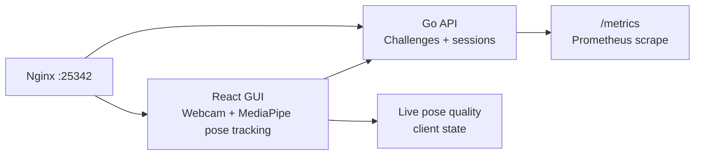

# Markerless Quest Lab

Markerless Quest Lab is a webcam-only motion-tracking playground inspired by the local-first spirit of [FreeMoCap](https://freemocap.org/) and its open-source project. The first milestone is a browser pose-tracking experience with sidequests that turn calibration and movement drills into unlockable interaction loops.

The repository is intentionally shaped like a deployable product from day one:

- Go backend with modular packages, structured logging, health endpoints, and Prometheus metrics.
- React + Vite frontend using MediaPipe Tasks Vision for battle-tested markerless pose landmarks in the browser.
- Docker Compose, Nginx, and optional Prometheus assets for port `25342`.
- Local git hooks and smoke checks instead of GitHub Actions.
- ADRs documenting the major technical choices.

## Architecture



The webcam stream stays in the browser. The backend receives only high-level challenge events and session metadata. The MediaPipe WASM runtime files required by the browser tracker are vendored from the npm package into `web/public/vendor/mediapipe/wasm` so the app does not depend on a fragile runtime CDN URL.

## Local Development

Prerequisites:

- Go 1.24 or newer
- Node.js 20 or newer
- Docker with Compose plugin

```bash
cp .env.example .env
go mod download
npm --prefix web install
npm --prefix web run dev
go run ./cmd/server
```

Open the frontend at the Vite URL during development. For a production-shaped local run:

```bash
docker compose up --build
open http://localhost:25342
```

## Checks

```bash
./scripts/check.sh
./scripts/smoke.sh
./scripts/install-hooks.sh
```

The hooks run the same local checks before commits and pushes. No CI configuration is included by design.

## Browser-only Demo

The frontend can run without the Go API. In browser-only mode it uses the local challenge catalog, local session state, vendored MediaPipe WASM, and the same real-time sidequest engine.

```bash
npm --prefix web run build:pages
./scripts/publish-pages.sh
```

After Pages is configured to serve the `gh-pages` branch, the demo URL is:

```text
https://baditaflorin.github.io/markerless-quest-lab/
```

## Container Publishing

Build amd64 images for GitHub Container Registry:

```bash
./scripts/build-and-push-amd64.sh
```

Then on the server:

```bash
cd deploy
docker compose -f docker-compose.server.yml pull
docker compose -f docker-compose.server.yml up -d
```

To run Prometheus beside the app:

```bash
docker compose -f docker-compose.server.yml --profile observability up -d
```

## Security Notes

- Do not commit `.env`, camera recordings, private keys, token files, or user exports containing biometric data.
- Webcam frames are processed in-browser by default.
- Server events should contain movement summaries and challenge IDs, not raw images.

## Documentation

- [ADR 0001: Local-first markerless pose tracking](docs/adr/0001-local-first-markerless-tracking.md)
- [ADR 0002: Go API and observability stack](docs/adr/0002-go-api-observability.md)
- [ADR 0003: Challenge GUI and unlock model](docs/adr/0003-challenge-gui-unlocks.md)
- [ADR 0004: Container deployment and local hooks](docs/adr/0004-container-deployment-local-hooks.md)
- [ADR 0005: Real-time sidequest engine and unlock modules](docs/adr/0005-realtime-sidequest-engine.md)
- [ADR 0006: Browser-only GitHub Pages demo](docs/adr/0006-browser-only-github-pages-demo.md)
- [Initial build postmortem](docs/postmortem/2026-05-07-initial-build.md)
